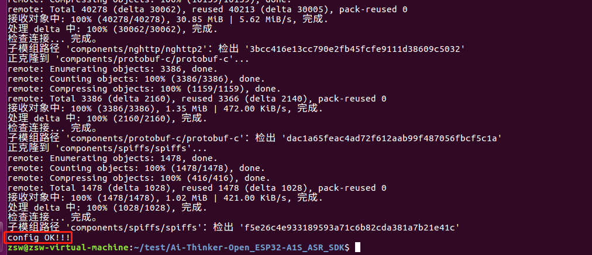
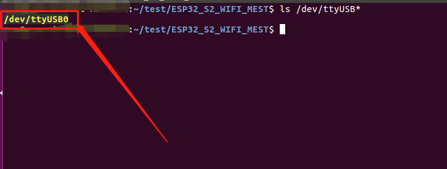
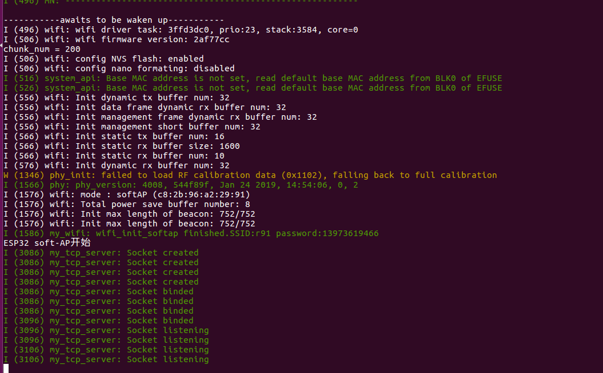

#环境搭建（Liunx）

##ESP-IDF v4.0 环境搭建（如之前搭建过可以忽略）

[ESP-IDF环境搭建](https://docs.espressif.com/projects/esp-idf/zh_CN/latest/esp32s2/index.html)

##拉取SDK

```
git clone https://github.com/Ai-Thinker-Open/Ai-Thinker-Open_ESP32-A1S_ASR_SDK.git
```

##环境配置

```
cd Ai-Thinker-Open_ESP32-A1S_ASR_SDK

. config_sdk.sh
```



##接入硬件

将开发板USB串口挂载到Liunx系统下USB0

你可以在终端输入。

ls /dev/ttyUSB*

如果返回如下内容，说明你已经绑定好了



##一键编译+烧入+调试离线语音例程
```
cd examples/Smart_home_scene_AI/

. rapid_flash.shrun
```
若烧入成功，命令行会让开发板启动离线语音应用程序




